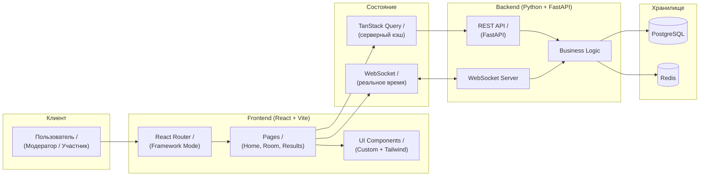

<div align="center">

# Poker Planning

**Инструмент для проведения планирования покером в реальном времени**

[](https://react.dev/)
[](https://vite.dev/)
[ ](https://tailwindcss.com/)
[](https://fastapi.tiangolo.com/)
[](https://www.postgresql.org/)

</div>

---

## Содержание

- [О проекте](#о-проекте)
- [Архитектура](#архитектура)
- [Быстрый старт](#быстрый-старт)
- [Команды](#команды)
- [Docker](#docker)

---

## О проекте

### Проблема

Проведение планирования покером в распределённых командах требует синхронизации участников, ручного подсчёта карт и часто приводит к рассинхрону при голосовании.

### Решение

**Poker Planning** — веб-приложение для оценки задач методом Planning Poker. Команда создаёт комнату, участники голосуют картами в реальном времени через WebSocket, результаты синхронизируются мгновенно для всех участников.

### Аудитория

- Разработчики
- Scrum-команды
- Тимлиды

---

## Архитектура



---

## Быстрый старт

### Требования

<div align="center">

| Компонент | Минимум | Рекомендуется |
| :-------: | :-----: | :-----------: |
|  Python   |  3.13+  |     3.13+     |
|  Node.js  | 18.18+  |      20+      |
|   pnpm    |   8+    |      9+       |

</div>

### Клонирование репозитория

```bash
git clone https://github.com/your-org/poker-planning.git

cd poker-planning
```

### Установка зависимостей

```bash
pnpm install
```

### Запуск приложения

```bash
pnpm dev
```

---

## Команды

### Root (monorepo)

```bash
# Запуск dev-задач (только frontend, т.к. backend на Python)
pnpm dev

# Запуск только frontend
pnpm dev:frontend

# Сборка всех пакетов
pnpm build

# Сборка только frontend
pnpm build:frontend

# Линтинг всех пакетов
pnpm lint

# Автоисправление линтинга + форматирование
pnpm lint:fix

# Только ESLint (проверка / автоисправление)
pnpm lint:eslint
pnpm lint:eslint:fix

# Только Stylelint (проверка / автоисправление)
pnpm lint:style
pnpm lint:style:fix

# Проверка типов
pnpm typecheck

# Автоформатирование всего репозитория
pnpm format

# Проверка форматирования без изменений файлов
pnpm format:check
```

### Frontend (targeted)

```bash
# Запуск только frontend
pnpm --filter @poker/frontend dev

# Сборка только frontend
pnpm --filter @poker/frontend build

# Предпросмотр production-сборки frontend
pnpm --filter @poker/frontend preview

# Линтинг frontend
pnpm --filter @poker/frontend lint

# Только ESLint frontend
pnpm --filter @poker/frontend lint:eslint
pnpm --filter @poker/frontend lint:eslint:fix

# Только Stylelint frontend
pnpm --filter @poker/frontend lint:style
pnpm --filter @poker/frontend lint:style:fix

# Форматирование только frontend/src
pnpm --filter @poker/frontend format
pnpm --filter @poker/frontend format:check
```

### Backend (Python/FastAPI)

```bash
# Переход в папку backend
cd apps/backend

# Создание виртуального окружения
python3 -m venv .venv
source .venv/bin/activate  # Linux/macOS

# Установка зависимостей
pip install -r requirements.txt

# Запуск в режиме разработки
uvicorn app.main:app --reload --host 0.0.0.0 --port 8000

# Миграции БД
alembic upgrade head

# Запуск через Docker Compose
docker compose up
```

### Docker

```bash
# Просмотр статуса контейнеров
docker-compose ps

# Просмотр логов
docker-compose logs -f

# Остановка всех сервисов
docker-compose down

# Полная очистка (удалить всё)
docker-compose down -v
```
